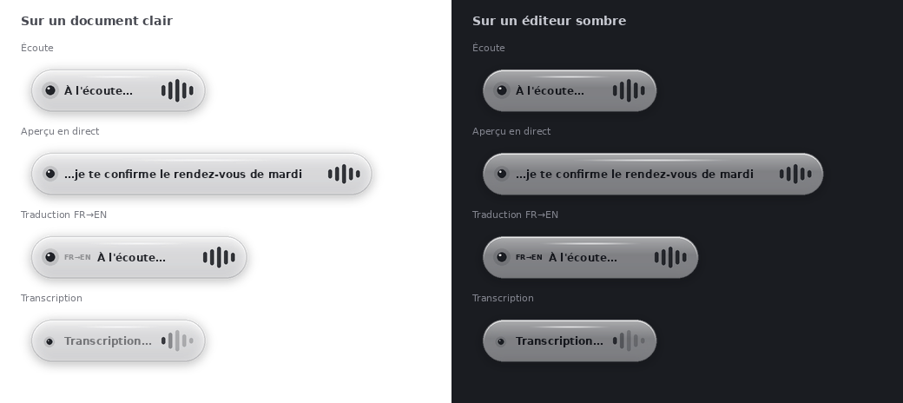

# Plume

[](LICENSE)

Local voice dictation for Windows. Press a hotkey, speak, and the text lands in
whatever app you were typing in. Nothing is sent anywhere: the speech
recognition runs on the machine, on the Intel Arc iGPU.

> **Just want to test it?** See [GUIDE_TEST.md](GUIDE_TEST.md) (français) — how
> to get the installer, run it, and report back.

- global hotkey (default `Ctrl + Espace`), press-to-toggle or push-to-talk;
- a floating frosted-glass bubble that reacts to your voice and shows the words
  **as you speak them**;
- transcription with Whisper `small`, FP16, on the Intel Arc iGPU (OpenVINO);
- **instant FR->EN translation** on a second shortcut (`Ctrl + Maj + Espace`),
  same model, same pass, still entirely local;
- automatic paste into the active app, or clipboard only;
- spoken punctuation, layout and **edit** commands ("nouveau paragraphe",
  "ouvrez les guillemets", "effacer le dernier mot"…), French typography;
- filler/repetition cleanup and a correction dictionary;
- local history of the last dictations.



Everything — audio, transcripts, settings — stays in `%APPDATA%\Plume`.

## Documentation

| Doc | What's in it |
|---|---|
| [GUIDE_TEST.md](GUIDE_TEST.md) | (français) Get the installer, run it, report back — the doc for a non-dev tester. |
| [docs/SECURITY.md](docs/SECURITY.md) | (français) What the app accesses, what leaves the machine (nothing, by default), and the file for a corporate security review. |
| [INSTALLER_WINDOWS.md](INSTALLER_WINDOWS.md) | How the Windows installer is built (PyInstaller + Inno Setup) and what it produces. |
| [docs/ARCHITECTURE.md](docs/ARCHITECTURE.md) | Code map: modules, the UI<->Python bridge, packaging, where data lives. |
| [docs/CONFIGURATION.md](docs/CONFIGURATION.md) | `config.json` schema, vocabulary/correction-dictionary format, hotkey format. |
| [CONTRIBUTING.md](CONTRIBUTING.md) | Dev setup, coding conventions, how to cut a release. |
| [docs/ROADMAP.md](docs/ROADMAP.md) | What shipped in 1.2.0 and what is being considered next. |
| [CHANGELOG.md](CHANGELOG.md) | Version history. |

## Install

Download `Plume-Setup-1.2.0.exe` from the releases and run it. It installs per
user (no admin rights) into `%LOCALAPPDATA%\Programs\Plume` and bundles
everything it needs, including the speech model — there is no first-run
download and no separate runtime to install.

Build notes: [INSTALLER_WINDOWS.md](INSTALLER_WINDOWS.md).

## Usage

1. Put the cursor where you want the text (Notepad, Outlook, Teams…).
2. Press `Ctrl + Espace`. The bubble appears and listens.
3. Speak.
4. Press `Ctrl + Espace` again. The transcript is pasted into the active app.

The engine stays warm after the first load, so everything after the first
dictation of a session starts instantly. The window lives in the system tray;
closing it does not quit the app.

## Engine

Plume ships one engine, and the UI has no picker for it: **OpenVINO GenAI on
the Intel Arc iGPU (`GPU`), running a Whisper `small` model converted to FP16
IR**, bundled next to the exe. That combination was chosen on measured latency
and transcription quality on the target hardware (Core Ultra); on those parts
the Arc iGPU is roughly 2-3x the throughput of the CPU baseline at comparable
quality, and the NPU trades speed for low power rather than winning on latency.

Two things remain in the code for robustness:

- **CPU fallback.** If OpenVINO or the iGPU turns out to be unusable on a given
  machine, the app falls back on its own to `faster-whisper` on CPU, says so in
  the status line, and keeps working.
- **The other profiles** (`ov-npu`, `ov-cpu`, `fw-cpu`) still exist in
  `PROFILES` (`plume.py`) and can be set by hand in `config.json` for
  diagnostics. Nothing in the UI leads there.

> Known issue, unchanged: the NPU profile fails with `Port for tensor name
> cache_position was not found` — a version conflict between `optimum-intel`'s
> export and the `openvino-genai` NPU static pipeline (confirmed on real Core
> Ultra hardware, 2026-08). It is not on the shipping path.

## Privacy

Transcription is local. No audio, no text, and no telemetry leaves the machine.

Out of the box the app opens **no outbound connection at all**: the update
check is an opt-in setting, off by default, and otherwise only runs when the
user presses "Vérifier". The speech model is bundled, so there is no Hugging
Face download either.

Details, including every file the app writes and every OS capability it uses:
[docs/SECURITY.md](docs/SECURITY.md).

## Running from source (development)

```powershell
py -3.12 -m venv .venv
.\.venv\Scripts\Activate.ps1
python -m pip install --upgrade pip
python -m pip install -r requirements.txt
python plume.py
```

The bundled OpenVINO engine is not installed by `requirements.txt`. From
source, either install `requirements-openvino.txt` and convert a model once:

```powershell
optimum-cli export openvino --model openai/whisper-small --weight-format fp16 models\openvino\whisper-small
```

…or let the app fall back to the CPU engine, which needs nothing extra.
`dictate.py` is a minimal CLI over the same engines, useful for diagnostics:

```powershell
python dictate.py --backend openvino --device GPU --model models\openvino\whisper-small --language fr
```

See [CONTRIBUTING.md](CONTRIBUTING.md) for conventions and the release
procedure.
